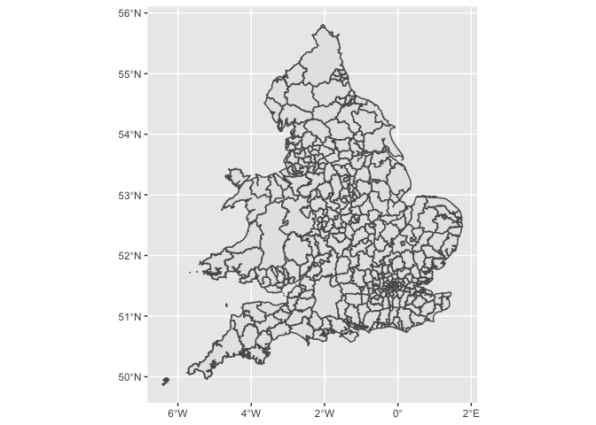
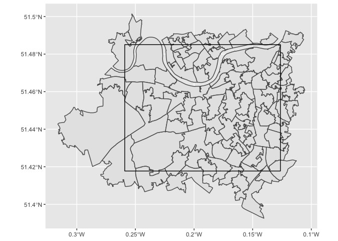
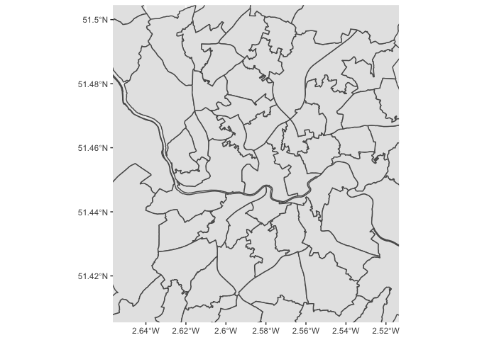
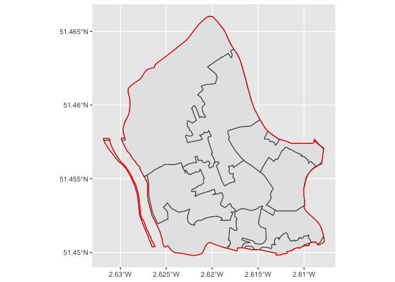

rgeoportal
================

## Installing rgeoportal

Install from github using devtools:

``` r
library(devtools)
install_github('Chrisjb/rgeoportal')
```

## get\_boundary

``` r
get_boundary(boundary_type = c("administrative", "census", "electoral",
                               "eurostat", "health", "other", "postcodes"),
             boundary_name = NA,
             bbox = NA,
             redius = NA,
             point = NA,
             names_like = NA,
             names_equal = NA,
             custom_polygon = NA)
```

### boundary\_type

We can get the boundary names available within each boundary type by
specifying `boundary_type` with no `boundary_name` option:

``` r
library(rgeoportal)
census_boundaries <- get_boundary(boundary_type = 'census')

head(census_boundaries)
```

    ##                                                                name
    ## 2           Built_Up_Area_Sub_Divisions_December_2011_Boundaries_V2
    ## 4                        Built_Up_Areas_December_2011_Boundaries_V2
    ## 6  Census_Merged_Local_Authority_Districts_December_2011_Boundaries
    ## 8                      Census_Merged_Wards_December_2011_Boundaries
    ## 10                Lower_Super_Output_Areas_December_2001_Boundaries
    ## 12                 Lower_Super_Output_Areas_December_2001_Centroids

``` r
administrative <- get_boundary(boundary_type = 'administrative')

head(administrative)
```

    ##                                                    name
    ## 2  Combined_Authorities_December_2018_Boundaries_EN_BFC
    ## 4  Combined_Authorities_December_2018_Boundaries_EN_BFE
    ## 6  Combined_Authorities_December_2018_Boundaries_EN_BGC
    ## 8  Combined_Authorities_December_2018_Boundaries_EN_BUC
    ## 10 Combined_Authorities_December_2019_Boundaries_EN_BFC
    ## 12 Combined_Authorities_December_2019_Boundaries_EN_BFE

Some of the boundary names come with a range of suffixes:

  - BFC: Full resolution - clipped to the coastline (Mean High Water
    mark).
  - BFE: Full resolution - extent of the realm (usually this is the Mean
    Low Water mark but in some cases boundaries extend beyond this to
    include off shore islands).
  - BGC: Generalised (20m) - clipped to the coastline (Mean High Water
    mark).
  - BUC: Ultra Generalised (500m) - clipped to the coastline (Mean High
    Water mark). Contains both Ordnance Survey and ONS Intellectual
    Property Rights.

Note that most boundaries have a maximim record count of 200. Large
requests will typically be limited to 200 observations.

### boundary\_name

We can select one of the boundary names returned from the above request
and set it as the `boundary_name`:

``` r
merged_auth <- get_boundary(boundary_type = 'census',
                                  boundary_name='Census_Merged_Local_Authority_Districts_December_2011_Boundaries')
```

``` r
head(merged_auth)
```

    ## Simple feature collection with 6 features and 6 fields
    ## geometry type:  MULTIPOLYGON
    ## dimension:      XY
    ## bbox:           xmin: -2.832457 ymin: 53.30503 xmax: -0.7884345 ymax: 54.72717
    ## CRS:            4326
    ## # A tibble: 6 x 7
    ##   objectid cmlad11cd cmlad11nm cmlad11nmw st_area.shape. st_length.shape.
    ##      <int> <chr>     <chr>     <chr>               <dbl>            <dbl>
    ## 1        1 E41000001 Hartlepo… " "             93892901.           68997.
    ## 2        2 E41000002 Middlesb… " "             53861837.           44918.
    ## 3        3 E41000003 Redcar a… " "            244915895.           93271.
    ## 4        4 E41000004 Stockton… " "            203920097.          155580.
    ## 5        5 E41000005 Darlingt… " "            197473286.          105743.
    ## 6        6 E41000006 Halton    " "             79115070.           76288.
    ## # … with 1 more variable: geometry <MULTIPOLYGON [°]>

``` r
library(ggplot2)
ggplot() + 
  geom_sf(data=merged_auth)
```

<!-- -->

## Specifying the request

In general we don’t want to request more data than we need. Many
boundaries also limit the amount of polygons any given request will
return to 200. There are several ways to request only the subset of the
total boundary data we need:

  - bbox: return only results in the specified bbox
  - radius: return only results within a given distance of a specified
    point
  - names\_like: return only results where the polygon name contains the
    given string(s)
  - names\_equal: return only results where the polygon name matches the
    given string(s)
  - custom\_polygon: return only results in the specified polygon

### bbox

One way to request a subset of boundary data is to add a `bbox` to the
request. We can set a bounding box in the form ‘xmin,ymin,xmax,ymax’ or
as an `sf` `bbox` as generated by `sf::st_bbox()`.

One way to get a bounding box is to use `st_bbox` on another set of
polygons:

``` r
my_auths <- merged_auth %>% filter(cmlad11nm %in% c('Wandsworth'))
my_bbox <- st_bbox(my_auths)
```

``` r
msoa_in_bbox <- get_boundary(boundary_type = 'census',
                             boundary_name='Middle_Super_Output_Areas_December_2011_Boundaries',
                             bbox = my_bbox)

head(msoa_in_bbox)
```

    ## Simple feature collection with 6 features and 6 fields
    ## geometry type:  MULTIPOLYGON
    ## dimension:      XY
    ## bbox:           xmin: -0.2275311 ymin: 51.47271 xmax: -0.1907725 ymax: 51.49169
    ## CRS:            4326
    ## # A tibble: 6 x 7
    ##   objectid msoa11cd msoa11nm msoa11nmw st_area.shape. st_length.shape.
    ##      <int> <chr>    <chr>    <chr>              <dbl>            <dbl>
    ## 1      371 E020003… Hammers… Hammersm…        399794.            6279.
    ## 2      372 E020003… Hammers… Hammersm…        437502.            4776.
    ## 3      373 E020003… Hammers… Hammersm…        407860.            4479.
    ## 4      374 E020003… Hammers… Hammersm…        531673.            3639.
    ## 5      375 E020003… Hammers… Hammersm…        628264.            5733.
    ## 6      376 E020003… Hammers… Hammersm…        347891.            3901.
    ## # … with 1 more variable: geometry <MULTIPOLYGON [°]>

``` r
ggplot() + 
  geom_sf(data=msoa_in_bbox) +
  geom_sf(data = st_as_sfc(my_bbox), colour = 'black', fill=NA)
```

<!-- -->

We can also specify a `bbox` from a user specified string:

``` r
msoa_in_bbox_2 <- get_boundary(boundary_type = 'census',
                             boundary_name='Middle_Super_Output_Areas_December_2011_Boundaries',
                             bbox = '-2.65,51.41,-2.52,51.50')

head(msoa_in_bbox)
```

    ## Simple feature collection with 6 features and 6 fields
    ## geometry type:  MULTIPOLYGON
    ## dimension:      XY
    ## bbox:           xmin: -0.2275311 ymin: 51.47271 xmax: -0.1907725 ymax: 51.49169
    ## CRS:            4326
    ## # A tibble: 6 x 7
    ##   objectid msoa11cd msoa11nm msoa11nmw st_area.shape. st_length.shape.
    ##      <int> <chr>    <chr>    <chr>              <dbl>            <dbl>
    ## 1      371 E020003… Hammers… Hammersm…        399794.            6279.
    ## 2      372 E020003… Hammers… Hammersm…        437502.            4776.
    ## 3      373 E020003… Hammers… Hammersm…        407860.            4479.
    ## 4      374 E020003… Hammers… Hammersm…        531673.            3639.
    ## 5      375 E020003… Hammers… Hammersm…        628264.            5733.
    ## 6      376 E020003… Hammers… Hammersm…        347891.            3901.
    ## # … with 1 more variable: geometry <MULTIPOLYGON [°]>

``` r
ggplot() + 
  geom_sf(data=msoa_in_bbox_2) +
  coord_sf(xlim = c(-2.65,-2.52),  ylim =c(51.41, 51.50))
```

<!-- -->

### radius

Another way to filter the request is to get boundaries within a set
radius of a given point. If radius is set, `point` must be set too.

`point` should be a longitude latitude point in the form ‘lng,lat’
`radius` is specified in meters

``` r
ward_in_radius <- get_boundary(boundary_type = 'admin',
                             boundary_name='Wards_May_2019_Boundaries_UK_BFC',
                             point = '-2.58791,51.45451',
                             radius = 2000)
```

### names\_like

If we don’t want to list the exact names of the wards, we can do partial
matching by specifying `names_like`. This is especially useful for
boundaries where the area name forms a predictable pattern such as msoa
names which all start with their local authority name.

Specifying `names_like` will return polygons that (partially) match the
name of the polygon

``` r
msoa_dartford <- get_boundary(boundary_type = 'census',
                             boundary_name='Middle_Super_Output_Areas_December_2011_Boundaries',
                             names_like = c('Dartford'))

head(msoa_dartford)
```

    ## Simple feature collection with 6 features and 6 fields
    ## geometry type:  POLYGON
    ## dimension:      XY
    ## bbox:           xmin: 0.1967327 ymin: 51.43022 xmax: 0.326364 ymax: 51.47966
    ## CRS:            4326
    ## # A tibble: 6 x 7
    ##   objectid msoa11cd msoa11nm msoa11nmw st_area.shape. st_length.shape.
    ##      <int> <chr>    <chr>    <chr>              <dbl>            <dbl>
    ## 1     4919 E020050… Dartfor… Dartford…       6562445.           11923.
    ## 2     4920 E020050… Dartfor… Dartford…       7581994.           26428.
    ## 3     4921 E020050… Dartfor… Dartford…       2507711.            8580.
    ## 4     4922 E020050… Dartfor… Dartford…       1628033.           10428.
    ## 5     4923 E020050… Dartfor… Dartford…       1565851.            6611.
    ## 6     4924 E020050… Dartfor… Dartford…       4940014.           11088.
    ## # … with 1 more variable: geometry <POLYGON [°]>

### names\_equal

If we know the exact name(s) of the polygon we want to return, we should
specify `names_equal`:

``` r
dg <- get_boundary(boundary_type = 'admin',
                             boundary_name='Local_Authority_Districts_December_2019_Boundaries_UK_BFC',
                             names_equal = c('Dartford', 'Gravesham'))

head(dg)
```

    ## Simple feature collection with 2 features and 10 fields
    ## geometry type:  POLYGON
    ## dimension:      XY
    ## bbox:           xmin: 0.1491599 ymin: 51.32501 xmax: 0.4911962 ymax: 51.47966
    ## CRS:            4326
    ## # A tibble: 2 x 11
    ##   objectid lad19cd lad19nm lad19nmw  bng_e  bng_n  long   lat st_area.shape.
    ##      <int> <chr>   <chr>   <chr>     <int>  <int> <dbl> <dbl>          <dbl>
    ## 1      130 E07000… Dartfo… " "      556167 172917 0.245  51.4      72725577.
    ## 2      132 E07000… Graves… " "      566969 169114 0.399  51.4      98991345.
    ## # … with 2 more variables: st_length.shape. <dbl>, geometry <POLYGON [°]>

### custom\_polygon

There is also the option to use a custom polygon and return boundaries
that intersect the given polygon.

We may need to simplify the polygon before sending the request:

``` r
custom_poly <- ward_in_radius %>% filter(wd19nm == 'Clifton')
custom_poly_simp <- rmapshaper::ms_simplify(custom_poly)
```

    ## Registered S3 method overwritten by 'geojsonlint':
    ##   method         from 
    ##   print.location dplyr

``` r
lsoa_in_poly <- get_boundary(boundary_type = 'census',
                             boundary_name='Lower_Super_Output_Areas_December_2011_Boundaries',
                             custom_polygon = custom_poly_simp)


ggplot() +
  geom_sf(data = st_intersection(lsoa_in_poly, custom_poly)) +
  geom_sf(data =custom_poly, color = 'red', fill=NA ) 
```

    ## although coordinates are longitude/latitude, st_intersection assumes that they are planar

    ## Warning: attribute variables are assumed to be spatially constant throughout all
    ## geometries

<!-- -->
